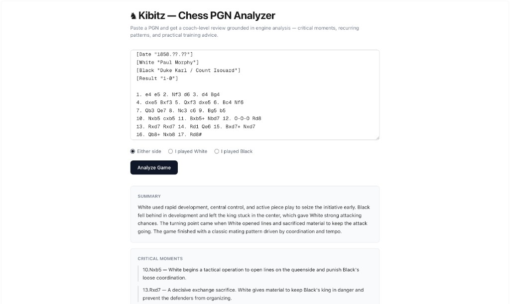
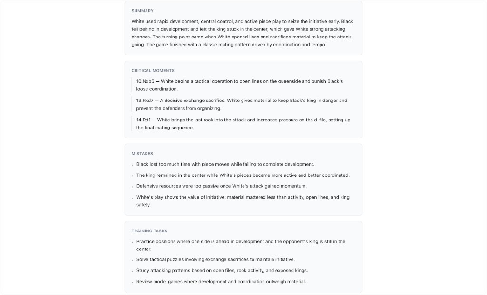
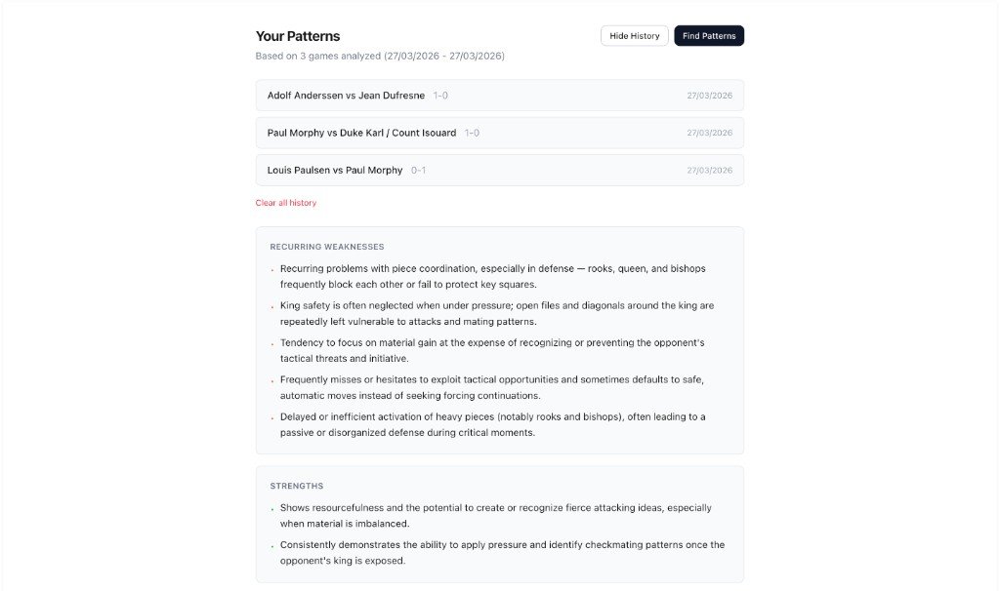
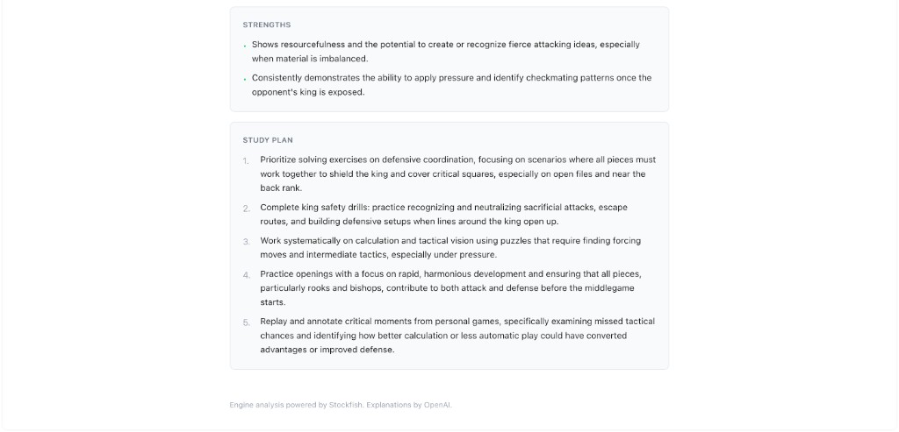

# ♞ Kibitz — Chess PGN Analyzer

Paste a PGN and get a coach-level review grounded in engine analysis — critical moments, recurring patterns, and practical training advice.

**[Try it live →](https://chess-analyzer-production-7ec2.up.railway.app/)**



## How It Works

1. **Parse** — chess.js validates the PGN and replays every move.
2. **Evaluate** — Stockfish scores each position (depth 10) and surfaces the top evaluation swings.
3. **Explain** — GPT-4.1 receives the move log, machine-verified board snapshots, and engine data, then returns a structured review: summary, critical moments, mistakes, and training tasks.



## Cross-Game Patterns

After three or more analyzed games, Kibitz identifies recurring weaknesses, strengths, and builds a prioritized study plan — turning single-game reviews into a personal improvement tracker.





## Stack

- **Next.js** (App Router, TypeScript, Tailwind CSS)
- **chess.js** — PGN parsing, move replay, board-state extraction
- **Stockfish** (ASM.js, single-threaded) — position evaluation
- **OpenAI Responses API** (GPT-4.1) — natural-language analysis

## Getting Started

```bash
npm install
```

Create `.env.local` in the project root:

```
OPENAI_API_KEY=your-key-here
```

Run the development server:

```bash
npm run dev        # → http://127.0.0.1:3000
```

Run tests:

```bash
npm test
```

## Copyright

Copyright © 2026 Joso Skarica. All rights reserved.

This repository is publicly visible for portfolio and evaluation purposes only.
No license is granted to use, copy, modify, distribute, or commercially exploit the source code in this repository.
